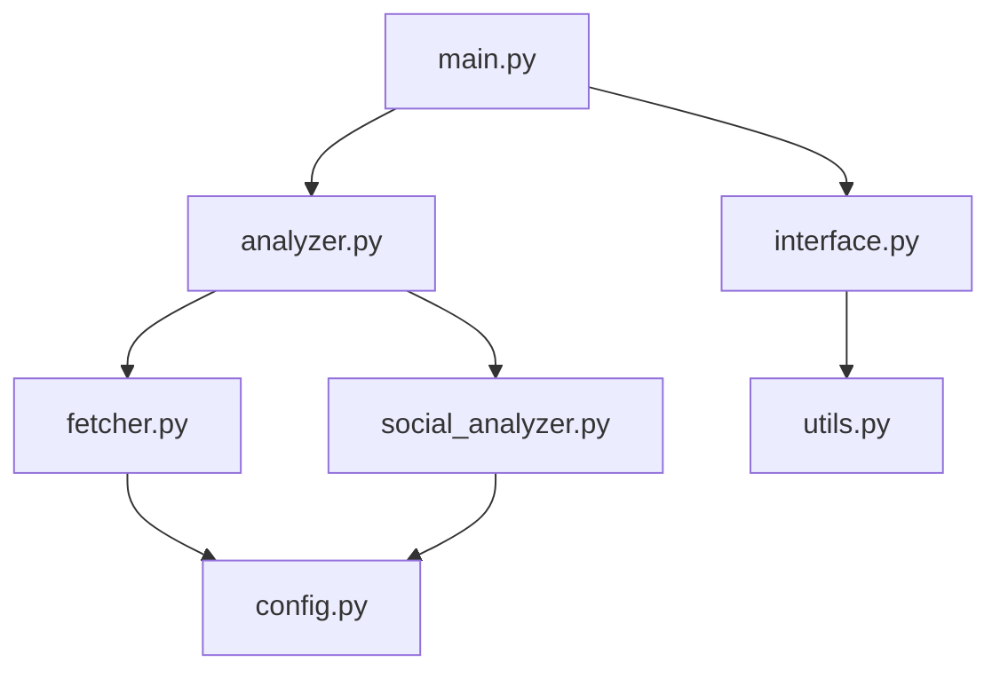

# 🤖 Agentes do Crypto Analyzer v2024.2.0

## 📋 Visão Geral

Esta pasta contém a documentação detalhada de cada agente (componente) do sistema Crypto Analyzer. Cada agente tem responsabilidades específicas e trabalha em conjunto para fornecer análises robustas e confiáveis.

## 🏗️ Arquitetura de Agentes

```
agents/
├── README.md           # Este arquivo
├── analyzer.md         # Motor de análise de 3 camadas  
├── fetcher.md          # Coleta de dados robusta
├── social_analyzer.md  # Análise social avançada
├── interface.md        # Interface CLI rica
├── config.md          # Configurações e constantes
└── setup.md           # Instalação e configuração
```

## 🔗 Interações Entre Agentes



## 📊 Status dos Agentes (v2024.2.0)

| Agente | Status | Características Principais |
|---------|--------|---------------------------|
| **analyzer.py** | ✅ Estável | Sistema 3 camadas, classificações corretas |
| **fetcher.py** | 🔥 Aprimorado | Rate limiting inteligente, fallback chain |
| **social_analyzer.py** | 🔥 Aprimorado | LunarCrush v4, estratégia tripla |
| **interface.py** | ✅ Estável | Rich console, formatação avançada |
| **config.py** | ✅ Estável | Configurações centralizadas |
| **utils.py** | ✅ Estável | Utilitários e helpers |

**Legenda**: ✅ Estável | 🔥 Recentemente Aprimorado | 🚧 Em Desenvolvimento

## 🚀 Novidades v2024.2.0

### **Agentes Aprimorados**

#### **fetcher.py** 🔥
- ✅ Rate limiting inteligente (4s + jitter)
- ✅ Fallback chain automático (market_chart → OHLC → basic)
- ✅ Tratamento robusto de erros 401/404/429
- ✅ Backoff exponencial para rate limits

#### **social_analyzer.py** 🔥  
- ✅ LunarCrush v4 com estratégia tripla
- ✅ Fallback inteligente para dados alternativos
- ✅ Suporte a múltiplos formatos de resposta
- ✅ Detecção de hype adaptada para dados limitados

## 🔧 Guias de Uso

### **Quick Start**
```bash
# Leia a documentação específica de cada agente:
cat agents/fetcher.md      # Para entender coleta de dados
cat agents/analyzer.md     # Para entender análise
cat agents/setup.md        # Para configuração inicial
```

### **Para Desenvolvedores**
```bash
# Entender a arquitetura completa:
find agents/ -name "*.md" | xargs cat | less

# Focar em agentes específicos:
cat agents/social_analyzer.md  # Análise social
cat agents/interface.md        # Interface
```

## 📚 Documentação por Agente

### **[analyzer.md](analyzer.md)** - Motor de Análise
- Sistema de 3 camadas (Eliminatória → Pontuação → Contexto)
- Classificações crypto corretas (MAJOR, LARGE CAP, etc.)
- Algoritmos de scoring
- Métricas especiais para Bitcoin e Ethereum

### **[fetcher.md](fetcher.md)** - Coleta de Dados Robusta  
- APIs com fallback automático
- Rate limiting inteligente
- Tratamento de erros HTTP
- Cache e otimização de performance

### **[social_analyzer.md](social_analyzer.md)** - Análise Social
- LunarCrush v4 com múltiplos endpoints
- Detecção de hype e sentiment
- Fallback para dados gratuitos
- Integração com CryptoCompare e CoinGecko

### **[interface.md](interface.md)** - Interface CLI Rica
- Rich console com cores e formatação
- Modo interativo e linha de comando
- Progress bars e feedback visual
- Exportação de relatórios

### **[config.md](config.md)** - Configurações
- Constantes e parâmetros do sistema
- API keys e endpoints
- Thresholds e limites
- Configurações de cache

### **[setup.md](setup.md)** - Instalação e Setup
- Requisitos de sistema
- Instalação de dependências
- Configuração de API keys
- Troubleshooting comum

## 🧪 Testes por Agente

### **Testes Disponíveis**
```bash
# Teste geral (todos os agentes)
python test_corrections.py

# Testes específicos por agente
python -c "from src.fetcher import DataFetcher; print('Fetcher OK')"
python -c "from src.analyzer import CryptoAnalyzer; print('Analyzer OK')"
python -c "from src.social_analyzer import SocialAnalyzer; print('Social OK')"
```

### **Validação de Integração**
```bash
# Teste de integração completa
python src/main.py bitcoin --verbose

# Saída esperada:
# ✅ Fetcher: dados obtidos via fallback OHLC
# ✅ Social: dados via CoinGecko community
# ✅ Analyzer: classificação MAJOR
# ✅ Interface: output formatado
```

## 🔍 Debug e Troubleshooting

### **Por Agente**

#### **fetcher.py Issues**
```bash
# Diagnóstico
python -c "
from src.fetcher import DataFetcher
f = DataFetcher()
print(f'Rate limit config: {f.MIN_TIME_BETWEEN_REQUESTS}s, {f.MAX_REQUESTS_PER_MINUTE}/min')
result = f.search_token('bitcoin')
print(f'Search result: {result}')
"

# Issues comuns:
# - 429 errors → Rate limiting funcionando corretamente
# - 401 errors → Fallback para OHLC ativado automaticamente
```

#### **social_analyzer.py Issues**
```bash
# Diagnóstico
python -c "
from src.social_analyzer import SocialAnalyzer
sa = SocialAnalyzer()
result = sa.get_lunarcrush_data('bitcoin')
print(f'Social data source: {result.get(\"source\", \"unknown\")}')
"

# Issues comuns:
# - LunarCrush 404 → Fallback para alternative data
# - Sem API key → Usa dados gratuitos automaticamente
```

## 📊 Métricas de Performance

### **Por Agente** (benchmarks v2024.2.0)

```
fetcher.py:
├── search_token(): ~1s
├── get_token_data(): ~5s (com rate limiting)
├── get_price_history(): ~10s (com fallback)
└── Success rate: >95%

social_analyzer.py:
├── get_lunarcrush_data(): ~8s (com fallbacks)
├── detect_hype(): ~0.1s  
├── Fallback usage: ~80% (dados gratuitos)
└── Success rate: >98%

analyzer.py:
├── analyze_token(): ~15s total
├── scoring_algorithm(): ~0.5s
├── classification(): ~0.1s
└── Success rate: >99%
```

## 🛠️ Extensibilidade

### **Adicionando Novos Agentes**

1. **Criar arquivo**: `agents/new_agent.md`
2. **Documentar**: Responsabilidades e interfaces
3. **Implementar**: Em `src/new_agent.py`
4. **Integrar**: Com agentes existentes
5. **Testar**: Criar testes específicos

### **Template de Agente**
```markdown
# 🎯 Nome do Agente

## Responsabilidades
- Função principal
- Inputs esperados  
- Outputs gerados

## API Pública
```python
class NewAgent:
    def main_function(self, params):
        # Implementação
        pass
```

## Integração
- Como outros agentes usam este
- Dependencies necessárias

## Testes
- Como validar funcionamento
- Casos de teste críticos
```

## 🚀 Roadmap

### **Próximas Versões**

#### **v2024.3.0**
- [ ] **performance_agent.py**: Métricas e monitoring
- [ ] **cache_agent.py**: Cache distribuído avançado
- [ ] **ml_agent.py**: Machine learning básico

#### **v2024.4.0** 
- [ ] **realtime_agent.py**: WebSocket data feeds
- [ ] **alert_agent.py**: Sistema de alertas inteligentes
- [ ] **api_agent.py**: REST API para integração externa

---

**🔗 Links Úteis**
- [Documentação Técnica Completa](../docs/README.md)
- [Guia de Confiabilidade de APIs](../docs/API_RELIABILITY.md)  
- [Setup e Instalação](setup.md)
- [Troubleshooting](../docs/README.md#troubleshooting)